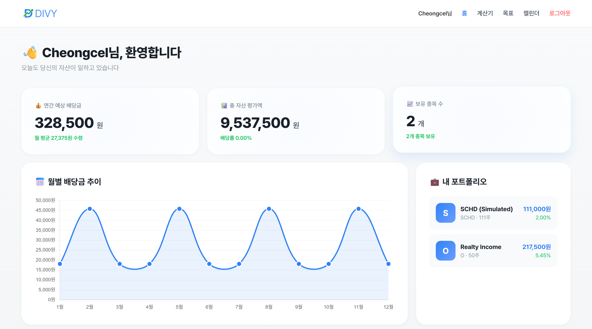
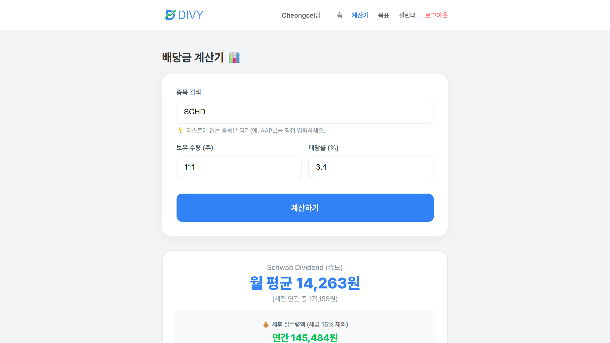
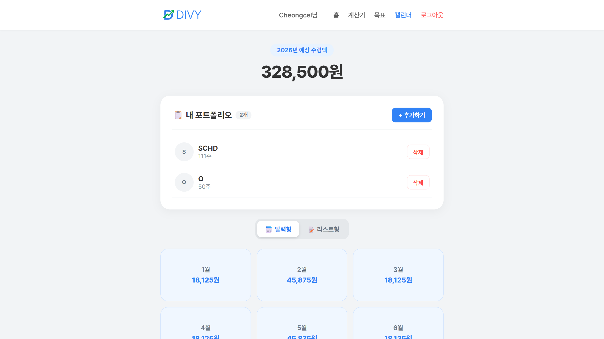
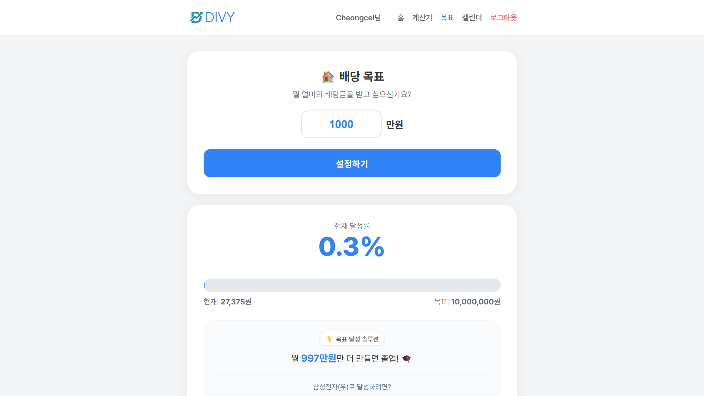
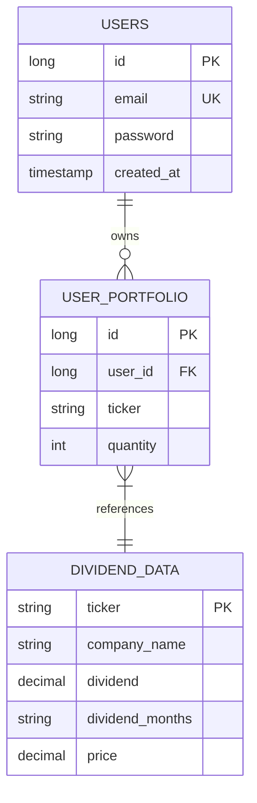

# 💰 DIVY - Dividend Calculator

**"Visualize your dividend cash flow in just 3 seconds."**

An intuitive asset management service designed to eliminate the complexity of dividend tracking and portfolio planning.

<br>

## 🌐 Live Demo

**🔗 Try it now:** https://divy-m1ta.onrender.com

> Deployed on Render with PostgreSQL

<br>

## 📸 Screenshots

### Dashboard

*Real-time portfolio analytics with Chart.js visualization*

### Calculator

*Instant dividend calculation for US stocks*

### Calendar

*12-month dividend distribution view*

### Goal Tracker

*Track your financial independence progress*

<br>

## 🎯 Strategic Overview

Many dividend investors struggle with fragmented data across different exchanges and the tedious task of manual calculation in spreadsheets. DIVY provides a seamless, "zero-barrier" experience for data-driven investment.

**The Problem:** Fragmented dividend schedules (monthly/quarterly) and complex currency conversions lead to high cognitive load.

**The Solution:** An automated dashboard that fetches, calculates, and visualizes dividend data with a single ticker input, reducing tracking time by 90%.

<br>

## ✨ Key Features

### 💼 Personalized Dashboard
Dynamic visualization of annual/monthly dividend trends using Chart.js.

### 🧮 Smart Calculator
Real-time calculation for KR/US stocks with automatic currency conversion logic.

### 📅 Dynamic Calendar
12-month distribution view with a toggle between Calendar and List formats for better cash flow planning.

### 🎯 Goal Tracker
Reverse-calculates the required capital to reach specific monthly passive income goals.

<br>

## 🏗️ Tech Stack

### Backend
- **Java 17** / **Spring Boot 3.2**
- **Spring Data JPA**
- **Session-based Authentication** (BCrypt encryption)
- **H2** (Dev) / **PostgreSQL** (Prod)

### Frontend
- **Thymeleaf** (Server-side Rendering)
- **Vanilla JavaScript** & **Chart.js**
- **CSS3** (Mobile-first Responsive Design)

<br>

## 🎨 Engineering Challenges & Solutions

### 1. Financial Data Integrity (Precision Management)
**Challenge:** Floating-point errors during dividend distribution across multiple months can lead to inaccurate financial reporting.

**Solution:** Utilized `BigDecimal` for all monetary calculations. Implemented a distribution algorithm using `RoundingMode.HALF_UP` to ensure "cent-perfect" accuracy.
```java
// Even distribution logic for quarterly/annual dividends
BigDecimal splitAmount = totalDividend.divide(
    new BigDecimal(dividendMonths.length), 
    2, // Precision to 2 decimal places
    RoundingMode.HALF_UP
);
```

### 2. Strategic UX Flow (Conversion Optimization)
**Challenge:** High user drop-off rates due to mandatory sign-up requirements.

**Solution:** Implemented a "Value-First" funnel. Users can access the calculator immediately. Core features (Save/Sync) are protected by a CSS blur effect and login redirection, successfully balancing feature preview and user acquisition.

### 3. RESTful Design & Data Isolation
**Challenge:** Maintaining clean separation between user portfolios.

**Solution:** Enforced strict data isolation at the service layer using Spring Security sessions. All portfolio queries filter by `userId`.

<br>

## 📊 Database Schema


<br>

## 🚀 Getting Started (Local Development)

### 1. Clone & Setup
```bash
git clone https://github.com/cheongcel/dividend.git
cd dividend
```

### 2. Run with Gradle
```bash
./gradlew bootRun
```

### 3. Access
```
http://localhost:8080
```

<br>

## 📈 Future Roadmap

- [ ] **Real-time API:** Transition from static data to Live Market Data API integration
- [ ] **Test Coverage:** Implementation of JUnit5/Mockito tests (Target: 80% coverage)
- [ ] **Mobile App:** React Native companion app for iOS/Android

<br>

## 📝 License

MIT License

<br>

## 👤 Developer

**Cheongcel**
- GitHub: [@cheongcel](https://github.com/cheongcel/dividend)
- Email: andfrank@naver.com

---

⭐ If this project helped you, please give it a star!
```

---
